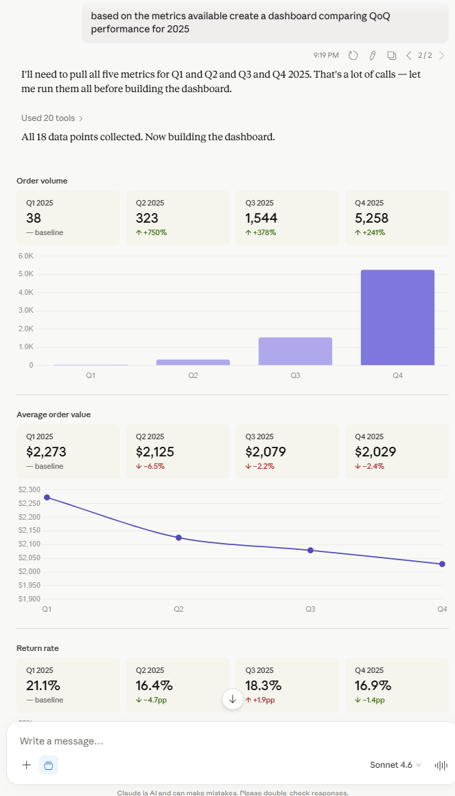

# Governed Metrics MCP

An MCP server that solves the analyst bottleneck without sacrificing governance.
Business users ask questions in plain English. The LLM calls governed metric
definitions — not raw SQL — so every answer comes from the same tested,
version-controlled business logic. **No hallucinated columns. No inconsistent
metrics. No SQL knowledge required.**

 [](https://github.com/brien-ruyak/governed-metrics-mcp/actions/workflows/ci.yml) 



## The Problem

Analytics teams have two persistent problems that no amount of tooling has fully solved.

The first is the **analyst bottleneck**. Business users can't self-serve on data questions — they either wait for an analyst to write a query, or they make decisions on gut feel. The bottleneck isn't access to data; it's access to correct, trusted data. Dashboards help, but they only answer the questions someone thought to ask in advance.

The second is **metric fragmentation**. Ask three analysts what "return rate" means and you get three different SQL queries. Different date filters, different join logic, different handling of cancelled orders. The disagreement surfaces in board meetings, not before them. Every team ends up with their own version of the truth, and reconciling them is expensive and political.

The instinct to solve this with LLMs — "just let the model write SQL" — makes both problems worse. Four things break immediately:

1. **Hallucinated columns** — the model guesses at column names it hasn't seen, producing queries that fail outright or silently return wrong results. There's no way to know which without checking the SQL yourself.
2. **Inconsistent metric logic** — "revenue" means one thing in the morning and another after lunch, because every query reinvents the calculation. An LLM doing this just gets inconsistent numbers faster.
3. **No guardrails** — the model can query anything, join anything, and return anything. There's no governance boundary between "questions the business wants answered" and "arbitrary SQL the model can generate." One bad query against a production database is all it takes.
4. **No data model, no self-service** — business users aren't SQL analysts. Even with direct database access, they can't navigate join relationships, understand foreign keys, or know which tables to trust. Without a layer that encodes that knowledge for them, self-service analytics remains a promise that never ships.

The deeper problem is structural: **there's no layer between the question and the database that encodes what the business actually means**. Without that layer, every query — human or LLM-generated — starts from scratch, and non-analysts are permanently locked out.

## The Pattern

Define each business metric once in YAML — its name, description, typed parameters, and SQL template. Expose each as an MCP tool. The LLM picks the right tool from the description, passes validated parameters, and gets structured results. It never touches SQL.
## The Pattern

The governed metrics layer is the missing layer between the question and the database.

Each business metric is defined once in YAML: its name, a description written for an LLM audience, the business logic encoded as a SQL template, the join relationships needed to compute it correctly, and typed parameters with validation constraints. That definition is the contract — version-controlled, tested, and shared across every consumer.

This directly addresses each failure mode:

1. **No hallucinated columns** — the LLM never sees the schema. It sees metric tool definitions and calls them with validated parameters. The SQL is generated from the YAML, not invented by the model.
2. **Consistent metric logic** — "return rate" is defined once. Every question that touches return rate uses the same calculation, the same filters, the same join logic. No drift, no reconciliation meetings.
3. **A hard governance boundary** — the LLM can only call governed metric tools. It cannot construct arbitrary queries, access tables outside the metrics layer, or bypass parameter validation. The boundary is enforced structurally, not by prompt.
4. **Self-service without SQL knowledge** — the business logic and join relationships are encoded in the metric definition. A non-analyst asks a question in plain English; the LLM selects the right metric, passes the right parameters, and gets a correct answer — without knowing a foreign key exists.

The metrics layer is dynamic, not a rigid pre-built dashboard. It answers the questions people actually ask, not just the ones someone anticipated. The pattern is what dbt metrics, Cube, and MetricFlow implement for BI tools. MCP makes it

```
Business question → LLM selects tool → MCP server validates params → DuckDB executes governed SQL → Structured result
```

The YAML definitions *are* the governance layer. See [docs/architecture.md](docs/architecture.md) for the full flow diagram.

## Quickstart

```bash
git clone https://github.com/brien-ruyak/governed-metrics-mcp.git
cd governed-metrics-mcp
uv sync
uv run python data/seed.py
uv run pytest -v
```

### Connect to Claude Desktop

Copy [examples/claude_desktop_config.json](examples/claude_desktop_config.json) into your Claude Desktop config (Settings → Developer → Edit Config). Replace `/ABSOLUTE/PATH/TO/governed-metrics-mcp` with your actual path, then restart Claude Desktop.

```json
{
  "mcpServers": {
    "governed-metrics": {
      "command": "uv",
      "args": [
        "run",
        "--directory",
        "/ABSOLUTE/PATH/TO/governed-metrics-mcp",
        "governed-metrics-mcp"
      ]
    }
  }
}
```

## Example Interactions

**"What was our order volume last quarter in the West region?"**

Claude calls `order_volume` with `start_date`, `end_date`, `region="West"` → returns `order_count` from DuckDB → answers with the exact number.

**"How does average order value compare between VIP and new customers?"**

Claude calls `average_order_value` twice — once with `segment="VIP"`, once with `segment="new"` → returns `avg_order_value` and `order_count` for each → compares them in its answer.

**"Which product categories have the highest return rate this year?"**

Claude calls `return_rate` multiple times with different `category` values, or once without a category filter → returns `return_rate`, `returned_orders`, `total_orders` → ranks the categories.

**"What are our top 5 electronics products by revenue this quarter?"**

Claude calls `top_products_by_revenue` with `category="electronics"`, `limit=5`, and date range → returns a ranked product list with revenue and units sold.

## Governed Metrics

| Metric | What it measures | Key parameters |
|---|---|---|
| `order_volume` | Order count over a time window | `region`, `channel`, `status` |
| `average_order_value` | AOV, optionally segmented | `segment`, `region`, `channel` |
| `repeat_purchase_rate` | % of cohort placing a second order within N days | `cohort_month` (required), `repeat_window_days` |
| `return_rate` | Returns as % of completed orders | `category`, `region` |
| `top_products_by_revenue` | Product ranking by revenue | `category`, `limit` |

All metrics accept optional `start_date` and `end_date` parameters (defaulting to the last 90 days).

## How It Works

The server has four layers:

1. **YAML Definitions** (`metrics/definitions/`) — Each file declares a metric: name, description, typed parameters, SQL template, and output schema. This is the governance contract.

2. **MetricRegistry** (`registry.py`) — Loads and validates all YAML definitions at startup via Pydantic. Malformed definitions fail fast with a clear error.

3. **MetricExecutor** (`executor.py`) — Takes a metric name and parameters, applies defaults, validates constraints, assembles SQL from the YAML template, and executes via DuckDB's parameterized query binding. User values never touch the SQL string.

4. **MCP Server** (`server.py`) — Built on Anthropic's FastMCP SDK. Dynamically registers each metric as a tool with a function signature matching the YAML's parameters. The LLM sees typed tool descriptions and parameter schemas — never table schemas or SQL.

Full architecture diagram: [docs/architecture.md](docs/architecture.md)

## Adding a New Metric

Adding a metric means adding a YAML file — no Python code changes. See [metrics/README.md](metrics/README.md) for the step-by-step walkthrough.

## Tech Stack

- **Python 3.11+** with `uv` for dependency management
- **[MCP SDK](https://github.com/modelcontextprotocol/python-sdk)** (FastMCP) — Anthropic's official Python SDK for the Model Context Protocol
- **DuckDB** — columnar analytics database, file-based, no server to run
- **Pydantic v2** — metric definition validation and typed results
- **PyYAML** — metric definitions as data, separate from code
- **Faker** — deterministic synthetic e-commerce data (seeded, reproducible)
- **pytest** — 46 tests verifying metric calculations against known data

## Why This Matters for Production AI Analytics

The "let the LLM write SQL" pattern breaks in production for the same reason ad-hoc SQL breaks without LLMs: no shared definitions, no validation, no governance. Two analysts asking the same question get different numbers. An LLM doing the same thing just gets different numbers faster.

The governed metrics layer solves this by making metrics a contract. The YAML definition is the single source of truth for what "return rate" means, what parameters it accepts, and how it's calculated. The LLM doesn't need to know your schema — it needs to know your metrics. This is the same pattern that dbt metrics, Cube, and MetricFlow implement for BI tools. MCP makes it work for LLMs.

The practical payoff: metric consistency without sacrificing natural-language access. A business user asks a question in plain English; the answer comes from a governed, tested, version-controlled metric definition — not from whatever SQL the model hallucinated. You get the flexibility of conversational analytics with the reliability of a metrics layer.

This demo uses a synthetic e-commerce dataset and DuckDB. The pattern applies to any domain and any database. The governance boundary — YAML definitions validated by Pydantic, exposed as typed MCP tools — is the part that transfers.

## What's Next

Two natural extensions of the governed metrics pattern worth exploring:

**Autonomous analysis agent** — instead of a human prompting the metrics server,
a scheduled agent runs a predefined analysis suite on a cadence. Every Monday
morning it pulls order volume, AOV, repeat purchase rate, and return rate for
the prior week, compares each to the previous period, flags anomalies against
configurable thresholds, and delivers a structured summary — no analyst required
to kick it off. The governed metrics layer makes this safe: the agent can only
call validated metric tools, so scheduled runs produce consistent, trustworthy
output rather than ad-hoc queries that drift over time.

**Exploratory mode with unvalidated labeling** — power users sometimes need to
go beyond the governed metric set to answer questions the YAML definitions don't
cover yet. An exploratory tool could allow more flexible querying against the
same read-only database, but tag every result as `unvalidated` in the response
metadata. This preserves the governance contract for core metrics while giving
analysts an escape hatch — the tradeoff between flexibility and trust is made
explicit rather than hidden. Results marked unvalidated can inform a decision
but should trigger a follow-up: if the answer matters, define it as a governed
metric and version-control it.

## License

MIT — see [LICENSE](LICENSE)