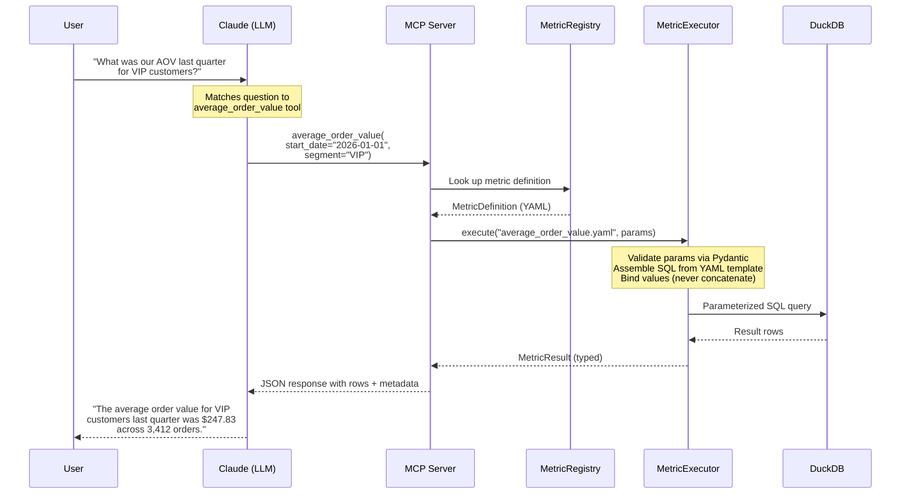

# Architecture

## How a question becomes a governed metric result

## The layers

**YAML Definitions** (`metrics/definitions/*.yaml`) — The governance layer. Each file declares a metric's name, description, typed parameters with validation rules, and SQL template. This is the single source of truth for what a metric means and how it's calculated. No business logic lives in Python code.

**MetricRegistry** (`registry.py`) — Loads and validates YAML definitions at startup using Pydantic. If a YAML file is malformed, the server fails fast with a clear error — not at query time when a user is waiting. Provides lookup by metric name.

**MetricExecutor** (`executor.py`) — The bridge between a tool call and the database. Applies defaults, coerces parameter types, validates enum constraints, assembles SQL from the YAML template's `sql_base` + applicable `sql_filters` + optional `sql_suffix`, and executes via DuckDB's named parameter binding. User values never touch the SQL string.

**MCP Server** (`server.py`) — Built on Anthropic's FastMCP SDK. On startup, iterates over registry definitions and dynamically registers each as a tool. Uses `inspect.Signature` to build typed function signatures from the YAML parameters — FastMCP introspects these to generate JSON Schema tool definitions that the LLM sees.

**DuckDB** — Columnar analytics database, file-based. Read-only connections, new connection per query. No server process to manage, no connection pool needed.

## The governance boundary

| What the LLM sees | What the LLM never sees |
|---|---|
| Tool names (`order_volume`, `return_rate`, ...) | Table names, column names, JOIN logic |
| Typed parameter schemas | Raw SQL templates |
| Parameter descriptions and enum constraints | Database schema or ERD |
| Structured JSON results with metadata | Raw query results or connection details |

The LLM picks the right tool from its description, passes validated parameters, and receives structured results. It cannot construct arbitrary queries, access tables outside the governed metrics, or bypass parameter validation.